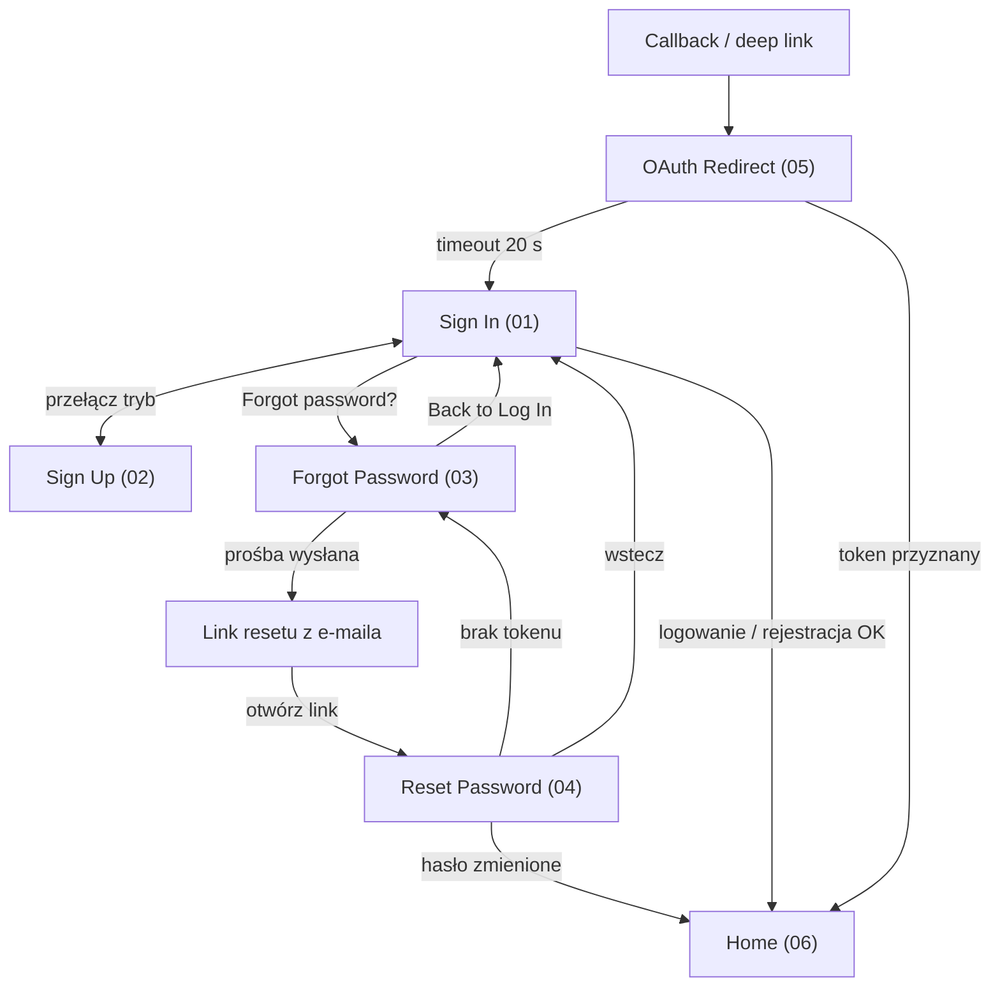
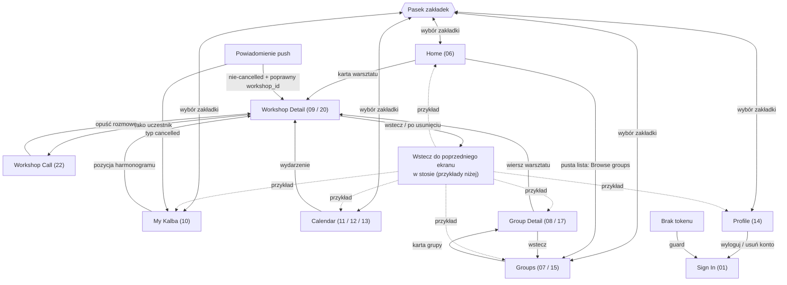
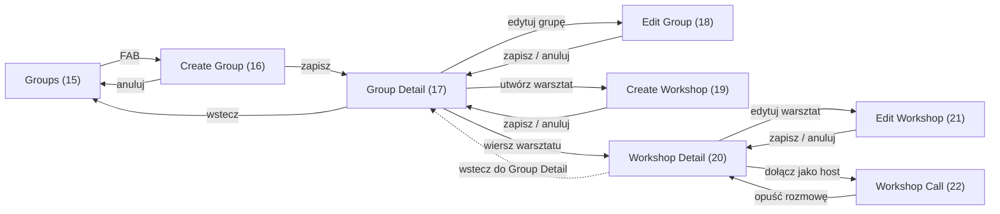

# Kalba — mapa przejść między ekranami

Mapa wyprowadzona z rzeczywistych wywołań nawigacji w kodzie (`router.push`,
`router.replace`, `router.back`, `Redirect`), a nie z opisu w dokumentacji.
Numery w nawiasach odpowiadają zrzutom w [`DEFAULT/`](./DEFAULT).

Wektory map (otwierają się w przeglądarce i można je dowolnie powiększać):
[autoryzacja](./NAVIGATION-01-auth.svg) ·
[nawigacja użytkownika](./NAVIGATION-02-user.svg) ·
[flow trenera](./NAVIGATION-03-trainer.svg).

Poniżej ich edytowalne źródło Mermaid oraz szczegółowa tabela z miejscami
w kodzie.

## Diagramy

### 1. Autoryzacja i wejścia zewnętrzne

### 2. Nawigacja użytkownika

### 3. Flow trenera

## Przejścia po ekranach

| Ekran | Dokąd można przejść | Wyzwalacz | Źródło |
|---|---|---|---|
| Sign In (01) | Sign Up (02) | przełącznik trybu | [AuthScreen.tsx:301](<../../src/components/AuthScreen.tsx#L301>) |
| | Forgot Password (03) | „Forgot password?" | [AuthScreen.tsx:375](<../../src/components/AuthScreen.tsx#L375>) |
| | Home (06) | logowanie e-mail/hasło lub Google zakończone sukcesem | [AuthScreen.tsx:265](<../../src/components/AuthScreen.tsx#L265>) |
| Sign Up (02) | Sign In (01) | przełącznik trybu | [AuthScreen.tsx:292](<../../src/components/AuthScreen.tsx#L292>) |
| | Home (06) | udana rejestracja | [AuthScreen.tsx:265](<../../src/components/AuthScreen.tsx#L265>) |
| Forgot Password (03) | Sign In (01) | wstecz (przed lub po wysłaniu prośby) | [forgot-password.tsx:77](<../../app/forgot-password.tsx#L77>), [forgot-password.tsx:135](<../../app/forgot-password.tsx#L135>) |
| | Link resetu z e-maila | formularz wysyła prośbę; dalsze przejście jest zewnętrzne | [forgot-password.tsx:32](<../../app/forgot-password.tsx#L32>) |
| Reset Password (04) | Forgot Password (03) | brak tokenu w deep linku | [reset-password.tsx:91](<../../app/reset-password.tsx#L91>) |
| Reset Password (04) | Home (06) | hasło zmienione | [reset-password.tsx:76](<../../app/reset-password.tsx#L76>) |
| | Sign In (01) | wstecz | [reset-password.tsx:176](<../../app/reset-password.tsx#L176>) |
| OAuth Redirect (05) | Home (06) | token przyznany | [oauthredirect.tsx:14](<../../app/oauthredirect.tsx#L14>) |
| | Sign In (01) | timeout 20 s | [oauthredirect.tsx:21](<../../app/oauthredirect.tsx#L21>) |
| Callback / deep link | OAuth Redirect (05) | otwarcie trasy `oauthredirect` | [oauthredirect.tsx](<../../app/oauthredirect.tsx>) |
| Home (06) | Workshop Detail (09 / 20) | karta warsztatu | [index.tsx:69](<../../app/(app)/(tabs)/index.tsx#L69>) |
| | Groups (07 / 15) | akcja pustej listy | [index.tsx:206](<../../app/(app)/(tabs)/index.tsx#L206>) |
| Groups (07 / 15) | Group Detail (08 / 17) | karta grupy | [GroupCard.tsx:36](<../../src/components/GroupCard.tsx#L36>) |
| | Create Group (16) | FAB, tylko trener | [groups.tsx:159](<../../app/(app)/(tabs)/groups.tsx#L159>) |
| My Kalba (10) | Workshop Detail (09 / 20) | pozycja harmonogramu | [my-kalba.tsx:206](<../../app/(app)/(tabs)/my-kalba.tsx#L206>) |
| Calendar (11 / 12 / 13) | Workshop Detail (09 / 20) | wydarzenie w dniu | [DayView.tsx:69](<../../src/components/calendar/DayView.tsx#L69>), [WeekView.tsx:143](<../../src/components/calendar/WeekView.tsx#L143>), [MonthView.tsx:162](<../../src/components/calendar/MonthView.tsx#L162>) |
| Profile (14) | Sign In (01) | wyloguj / usuń konto | [profile.tsx:44](<../../app/(app)/(tabs)/profile.tsx#L44>), [profile.tsx:83](<../../app/(app)/(tabs)/profile.tsx#L83>) |
| Group Detail (08 / 17) | Workshop Detail (09 / 20) | wiersz warsztatu | [group/[id].tsx:62](<../../app/(app)/group/[id].tsx#L62>) |
| | Edit Group (18) | edytuj, tylko właściciel | [group/[id].tsx:194](<../../app/(app)/group/[id].tsx#L194>) |
| | Create Workshop (19) | utwórz warsztat, tylko właściciel | [group/[id].tsx:291](<../../app/(app)/group/[id].tsx#L291>) |
| | Groups (07 / 15) | wstecz | [group/[id].tsx:184](<../../app/(app)/group/[id].tsx#L184>) |
| Workshop Detail (09 / 20) | Workshop Call (22) | dołącz; rola uczestnika lub hosta według odpowiedzi API | [workshop/[id].tsx:57](<../../app/(app)/workshop/[id].tsx#L57>) |
| | Edit Workshop (21) | edytuj, tylko właściciel | [workshop/[id].tsx:229](<../../app/(app)/workshop/[id].tsx#L229>) |
| | poprzedni ekran w stosie (może być dowolny ekran źródłowy) | wstecz | [workshop/[id].tsx:163](<../../app/(app)/workshop/[id].tsx#L163>) |
| | poprzedni ekran w stosie | po usunięciu warsztatu | [workshop/[id].tsx:83](<../../app/(app)/workshop/[id].tsx#L83>) |
| Create Group (16) | Group Detail (08 / 17) | po zapisie | [create-group.tsx:67](<../../app/(app)/create-group.tsx#L67>) |
| | Groups (07 / 15) | anuluj | [create-group.tsx:89](<../../app/(app)/create-group.tsx#L89>) |
| Create Workshop (19) | Group Detail (08 / 17) | po zapisie / anuluj | [create-workshop.tsx:219](<../../app/(app)/create-workshop.tsx#L219>), [create-workshop.tsx:242](<../../app/(app)/create-workshop.tsx#L242>) |
| Edit Group (18) | Group Detail (08 / 17) | po zapisie / anuluj | [group/edit.tsx:69](<../../app/(app)/group/edit.tsx#L69>), [group/edit.tsx:99](<../../app/(app)/group/edit.tsx#L99>) |
| Edit Workshop (21) | Workshop Detail (09 / 20) | po zapisie / anuluj | [workshop/edit.tsx:178](<../../app/(app)/workshop/edit.tsx#L178>), [workshop/edit.tsx:218](<../../app/(app)/workshop/edit.tsx#L218>) |
| Workshop Call (22) | Workshop Detail (09 / 20) | opuść rozmowę | [call.tsx:145](<../../app/(app)/workshop/call.tsx#L145>) |

## Przejścia poza UI

| Z | Do | Wyzwalacz | Źródło |
|---|---|---|---|
| Dowolny ekran chroniony | Sign In (01) | brak tokenu | [\_layout.tsx:20](<../../app/(app)/_layout.tsx#L20>) |
| Dowolny ekran | My Kalba (10) | powiadomienie „cancelled" | [\_layout.tsx:100](<../../app/_layout.tsx#L100>) |
| Dowolny ekran | Workshop Detail | nie-cancelled powiadomienie z poprawnym `workshop_id` | [\_layout.tsx:105](<../../app/_layout.tsx#L105>) |

## Uwagi

- **Pasek zakładek** jest pokazany jako kontrolka `TAB` połączona ze wszystkimi
  pięcioma ekranami — z każdego taba można przejść do dowolnego innego.
- **Ekrany 07/15, 08/17 i 09/20 to ten sam kod** w dwóch kontekstach roli.
  Groups (07/15) różni się tylko obecnością FAB-a dla trenera; Group Detail
  (08/17) i Workshop Detail (09/20) pokazują dodatkowe akcje dla właściciela.
- **Przejścia oznaczone „tylko właściciel" / „tylko trener"** są warunkowane
  rolą w UI. Backend egzekwuje je niezależnie.
- **Ekrany 11/12/13** to trzy widoki tego samego ekranu Calendar
  (miesiąc / tydzień / dzień), przełączane lokalnie — nie są osobnymi trasami.
- **Ekran 22** ma osobną implementację webową
  ([call.web.tsx](<../../app/(app)/workshop/call.web.tsx>)), ale te same przejścia
  wejścia i wyjścia.
- **Powrót ze szczegółów warsztatu** używa `router.back()`, więc wraca do
  poprzedniego ekranu w stosie. Strzałki na mapie pokazują typowe przykłady,
  nie zamkniętą listę źródeł — powiadomienie może otworzyć szczegóły także
  np. z Profile.
- **Workshop Call (22)** jest wspólnym ekranem rozmowy dla uczestnika i hosta;
  diagram użytkownika pokazuje dołączenie jako uczestnik, a diagram trenera
  jako hosta.
