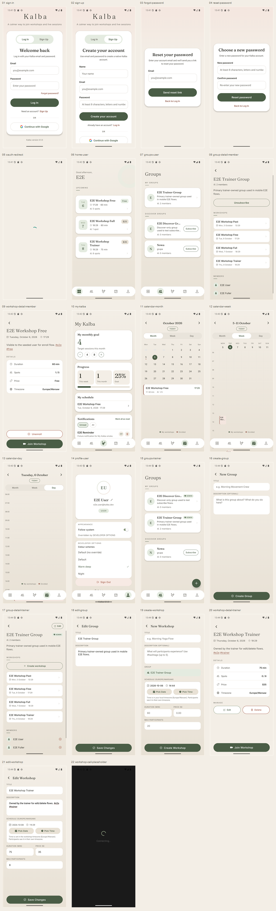
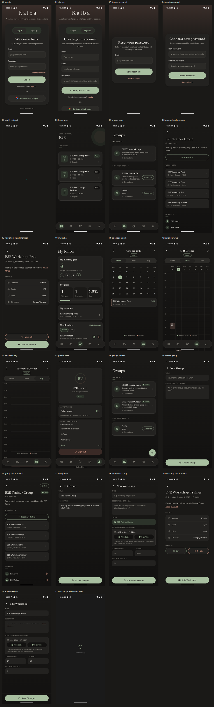

# Kalba — screen flow (Android)

Zrzuty pokazują rzeczywisty render aplikacji uruchomionej na emulatorze
Androida, a nie makiety.

- Data: 2026-10-03
- Emulator: AVD na profilu Pixel 6, Android API 36, 1080 × 2400
- Dane: syntetyczne fixtures E2E w tymczasowej, odizolowanej bazie
- Backend: lokalny; bez używania produkcyjnego API i danych użytkowników

## Mapa przejść

| Obszar | Mapa SVG |
|---|---|
| Autoryzacja i wejścia zewnętrzne | [Mapa autoryzacji (SVG)](./NAVIGATION-01-auth.svg) |
| Nawigacja użytkownika | [Mapa ekranów użytkownika (SVG)](./NAVIGATION-02-user.svg) |
| Flow trenera | [Mapa flow trenera (SVG)](./NAVIGATION-03-trainer.svg) |

Pełna mapa z edytowalnym diagramem Mermaid, opisem przejść i odnośnikami do
wywołań nawigacji w kodzie: [NAVIGATION.md](./NAVIGATION.md).

## Zrzuty

Zestaw bazowy znajduje się w `DEFAULT/`. Kolejne eksperymenty wizualne
zapisuj jako osobne zestawy, nie nadpisując `DEFAULT`.

| # | Ekran | Kontekst | Screenshot |
|---:|---|---|---|
| 01 | Sign In | Logowanie | [01-sign-in.png](./DEFAULT/01-sign-in.png) |
| 02 | Sign Up | Rejestracja | [02-sign-up.png](./DEFAULT/02-sign-up.png) |
| 03 | Forgot Password | Odzyskiwanie hasła | [03-forgot-password.png](./DEFAULT/03-forgot-password.png) |
| 04 | Reset Password | Formularz z testowym, nieużytym tokenem | [04-reset-password.png](./DEFAULT/04-reset-password.png) |
| 05 | OAuth Redirect | Przejściowy ekran ładowania | [05-oauth-redirect.png](./DEFAULT/05-oauth-redirect.png) |
| 06 | Home | Użytkownik | [06-home-user.png](./DEFAULT/06-home-user.png) |
| 07 | Groups | Użytkownik | [07-groups-user.png](./DEFAULT/07-groups-user.png) |
| 08 | Group Detail | Członek grupy | [08-group-detail-member.png](./DEFAULT/08-group-detail-member.png) |
| 09 | Workshop Detail | Zapisany uczestnik | [09-workshop-detail-member.png](./DEFAULT/09-workshop-detail-member.png) |
| 10 | My Kalba | Cel, statystyki, harmonogram i powiadomienia | [10-my-kalba.png](./DEFAULT/10-my-kalba.png) |
| 11 | Calendar — month | Widok miesięczny | [11-calendar-month.png](./DEFAULT/11-calendar-month.png) |
| 12 | Calendar — week | Widok tygodniowy | [12-calendar-week.png](./DEFAULT/12-calendar-week.png) |
| 13 | Calendar — day | Widok dzienny | [13-calendar-day.png](./DEFAULT/13-calendar-day.png) |
| 14 | Profile | Użytkownik | [14-profile-user.png](./DEFAULT/14-profile-user.png) |
| 15 | Groups | Trener | [15-groups-trainer.png](./DEFAULT/15-groups-trainer.png) |
| 16 | Create Group | Trener | [16-create-group.png](./DEFAULT/16-create-group.png) |
| 17 | Group Detail | Właściciel grupy / trener | [17-group-detail-trainer.png](./DEFAULT/17-group-detail-trainer.png) |
| 18 | Edit Group | Trener | [18-edit-group.png](./DEFAULT/18-edit-group.png) |
| 19 | Create Workshop | Trener | [19-create-workshop.png](./DEFAULT/19-create-workshop.png) |
| 20 | Workshop Detail | Właściciel warsztatu / trener | [20-workshop-detail-trainer.png](./DEFAULT/20-workshop-detail-trainer.png) |
| 21 | Edit Workshop | Trener | [21-edit-workshop.png](./DEFAULT/21-edit-workshop.png) |
| 22 | Workshop Call | Ekran „Connecting…” | [22-workshop-call-placeholder.png](./DEFAULT/22-workshop-call-placeholder.png) |

## Zbiorcze podglądy

| Zestaw | Motyw | Data | Zrzuty | Generowanie |
|---|---|---|---|---|
| [DEFAULT](./DEFAULT/overview.png) | Baseline | 2026-10-06 | 22 | rebuild, wersja 0.1.0 |
| [WARM-DEEP](./WARM-DEEP/overview.png) | Ciepły, pogłębiony | 2026-10-06 | 22 | rebuild, wersja 0.1.0 |
| [NIGHT](./NIGHT/overview.png) | Ciemny | 2026-10-06 | 22 | rebuild, wersja 0.1.0 |

### DEFAULT


### WARM-DEEP



### NIGHT



## Jak wygenerować ponownie

1. Uruchom backend wskazujący na świeżą, odizolowaną bazę PostgreSQL.
   Nie używaj bazy z innymi danymi — pojawią się one na ekranach grup i
   warsztatów. Następnie utwórz deterministyczne fixtures:

   ```powershell
   python test/automated/prepare_mobile_e2e.py
   ```

   Skill `start-local-backend` uruchamia trwałą bazę developerską `kalba`;
   screen-flow nie ma jeszcze własnego runnera, który tworzy i usuwa bazę
   efemeryczną. Ustaw `DATABASE_URL` dla migracji, API i seedera na ten sam
   świeży kontener. Nie kieruj seedera na stage ani produkcję.

2. Zbuduj i zainstaluj APK dla wybranego motywu:

   ```powershell
   npm run android:release:local              # DEFAULT
   npm run android:release:local:warm-deep    # WARM-DEEP
   npm run android:release:local:night        # NIGHT
   ```

   Motyw jest wybierany podczas bundlowania przez `EXPO_PUBLIC_THEME`.
   Zapisuj każdy eksperyment w katalogu odpowiadającym motywowi, nie w
   `DEFAULT/`.

3. Uruchom wszystkie trzy flows, wskazując ten sam katalog wyjściowy
   Maestro. Przykład dla `WARM-DEEP`:

   ```powershell
   maestro --device emulator-5554 test `
     --test-output-dir docs/screen-flow/WARM-DEEP `
     test/automated/maestro/flows/screen-flow/capture_user.yaml

   maestro --device emulator-5554 test `
     --test-output-dir docs/screen-flow/WARM-DEEP `
     test/automated/maestro/flows/screen-flow/capture_trainer.yaml

   maestro --device emulator-5554 test `
     --test-output-dir docs/screen-flow/WARM-DEEP `
     test/automated/maestro/flows/screen-flow/capture_call_placeholder.yaml
   ```

4. Maestro zapisuje PNG w podkatalogu `screenshots/` wewnątrz katalogu
   wyjściowego. Przenieś 22 nazwane PNG do katalogu zestawu, wygeneruj
   `overview.png` i usuń katalogi debugowe z datami.

Zestaw `DEFAULT` odtwarzaj tylko wtedy, gdy chcesz świadomie zmienić
baseline. Nowe eksperymenty zapisuj w osobnym katalogu. Flow logowania
otwierają bezpośrednio kolejne pola formularza — nie dodawaj `hideKeyboard`
między nimi, bo na Androidzie może to zamknąć aplikację.

> **Uwaga (2026-10-06):** poprzedni render zestawów (2026-10-03/04) powstał na
> przed-runtime pipeline i nie obejmował nowych ekranów (WYGLĄD, OPCJE
> DEWELOPERSKIE, stopka wersji). Obecny zestaw pochodzi z aplikacji **0.1.0**
> (build-time pin palet, sekwencyjnie) — zgodny z tym, co dostali testerzy.
> Gdy galeria zacznie się rozjeżdżać z apką, zregeneruj wszystkie trzy zestawy
> jedną komendą na main (patrz `make-release` skill).

## Jak ponownie wyrenderować mapy SVG

Źródłem diagramów są trzy bloki Mermaid w [NAVIGATION.md](./NAVIGATION.md).
Do renderowania potrzebujesz Node.js, Mermaid CLI 12.0.0, Puppeteer 25.12.0
i jego przeglądarki Chromium:

```powershell
npm install --global @mermaid-js/mermaid-cli@12.0.0 puppeteer@25.12.0
python docs/screen-flow/render_navigation.py
```

Skrypt [render_navigation.py](./render_navigation.py) odczytuje trzy bloki
Mermaid z `NAVIGATION.md` i nadpisuje odpowiadające im pliki SVG. Nie wymaga
dodatkowych paczek Python. Jeśli Puppeteer ma użyć innej przeglądarki, przekaż
plik konfiguracyjny przez `--puppeteer-config-file`.

## Uwagi

- Ekrany Sign Up, Reset Password i OAuth Redirect to stany tego samego
  przepływu uwierzytelniania; Reset Password pokazuje formularz, ale nie
  wysyła żądania zmiany hasła.
- Ekran rozmowy został otwarty z testowym tokenem i zarezerwowanym adresem
  `example.invalid`. Pokazuje widok łączenia, nie aktywne połączenie Daily
  ani kontrolki rozmowy. Nie używałem skonfigurowanych poświadczeń Daily
  ani kamery/mikrofonu hosta.
- To zrzuty Androida. iOS Simulator wymaga macOS; osobny render webowy nie
  jest częścią tej galerii.
- Odtwarzalne flows Maestro:
  [użytkownik](../../test/automated/maestro/flows/screen-flow/capture_user.yaml),
  [trener](../../test/automated/maestro/flows/screen-flow/capture_trainer.yaml),
  [podgląd połączenia](../../test/automated/maestro/flows/screen-flow/capture_call_placeholder.yaml).
